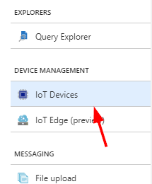
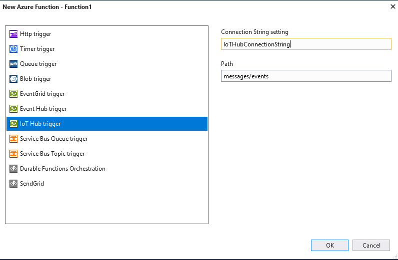

# Azure IoT and Serverless Button Sample

The following sample will walk you through building an IoT application to post a tweet to Twitter.

If you have any questions or issues feel free to create them on this repo following the provided templates.

## Visual Studio 2017 and C# Walkthrough

The following walkthrough will guide you in building an application that can process IoT messages and have them take an action like sending a tweet.

## Pre-requisites

The sample assumes the following are already ready:

* [Visual Studio 2017 (any edition) with the Cloud workload included](https://www.visualstudio.com/downloads/)
* [An Azure Subscription (free trial works great)](https://azure.microsoft.com/en-us/free/)

The following are optional:

* An IoT button that can send an event to IoT Hub (the teXXmo Azure Certified button works great)

## Creating an IoT Hub

The first step we need to do is create the IoT Hub.  Azure IoT Hub allows you to manage, configure, and monitor IoT devices. 

1. Open the [Azure Portal](https://portal.azure.com) and sign-in with an account
1. Click the **+** or **Create a resource** button in the top left, select **Internet of Things** and then **IoT Hub**
1. Provide a *globally* unique name for your hub, and select the pricing tier (Basic tier if fine)
1. Create/Select a resource group
1. Select the option to pin to dashboard
1. Click the create button
1. Click the **IoT Devices** section of the settings pane  
      
1. Click **Add** and create a device ID for this device.  Click **Save**
1. Select and open the newly created device. You will need this info to connect the device to the cloud.

## Connecting a Device to the IoT Hub

### With a device simulator

If you do not have a teXXmo button, you are welcome to use the community managed simulator which will send a "device to cloud" to your IoT hub.  To use visit [this link](https://prodiotsimulator.blob.core.windows.net/site/index.html) and simulate a button press by pressing the "Submit" button after adding the device connection string from the previous section (Device details page).

> NOTE: This site is community managed. Only use for simple tests with non-production IoT Hubs

### With a teXXmo button

If using the teXXmo button to connect with Azure IoT Hub, follow the instructions to connect to the button access point (hold down button for a few seconds until blinking yellow, then connect to broadcast access point).  Go to the device configuration page in a web browser (http://192.168.4.1) and configure the IoT Hub with your Device Id, Key, and Hub hostname.  The IoT Hub Hostname can be found on the **Overview** section of the blad.

### With the IoT Hub SDK

If you do not have a button and don't want to use the community button simulator, I recommend using the SDK directly in your own Visual Studio project. Instructions can be [found here](https://docs.microsoft.com/en-us/azure/iot-hub/iot-hub-csharp-csharp-getstarted#introduction)

## Creating the Azure Function

Now that you have an IoT Hub and a connected device, we need to write a simple Azure Function to process the data the devices are generating.

1. Open Visual Studio 2017
    * Make sure all updates have been installed for 2017 and the Azure Functions and WebJobs tools.  This sample relies on the latest templates
1. **File** -> **New Project** and under **Visual C#** -> **Cloud** select **Azure Functions**
1. Select the **Azure Functions v2 Preview** runtime in the dropdown and start with an **empty project**.  Leave the defaults as-is.
1. Right-click the project created in the **Solution Explorer** on the right-hand side and select **Add** -> **New Item**
1. Select **Azure Function** from the list of Visual C# Items and select **Add**
1. Choose the **IoT Hub trigger** template
1. The IoT Hub **Connection String setting** is the name of the environment variable that contains the connection string. We will set this up later, but for now enter `IoTHubConnectionString` as the name of the environment variable.
1. Leave **Path** as `messages/events` and click **OK**  
      

### Getting the IoT Hub connection string

IoT Hub communicates with Azure Functions triggers via the events endpoint.  First we need to get the events endpoint connection string.

1. Open up your previously created IoT Hub in the [Azure Portal](https://portal.azure.com)
1. On the left-hand navigation select **Endpoints**
1. Click the **Events** endpoint
1. Copy the **Event Hub-compatible endpoint** and also the **Event Hub-compatible name**
1. To generate a valid Connection String you need to append the **name** to the **endpoint** with the following template: {endpoint};EntityPath={name}
    * For example: if my **compatible endpoint** was `Endpoint=sb://myendpoint.net/;SharedAccessKeyName=123=` and my **compatible name** was `myiothub` my **Connection STring** would be `Endpoint=sb://myendpoint.net/;SharedAccessKeyName=123=;EntityPath=myiothub`

### Setting the IoT Hub Connection String in the Function

If you recall from the project creation of the Azure Function, you set an environment variable called `IoTHubConnectionString` as the connection string setting.  In order to set this environment variable in your local development, the easiest method is to set it as a value in the `local.settings.json` file.  This can store and create environment variables for local development.

1. Open the Azure Function project in Visual Studio 2017
1. Open the **local.settings.json** file
1. Add an additional `Values` for the `IoTHubConnectionString`. For example (NOTE: don't use this connection string, use yours)
    ```json
    {
    "IsEncrypted": false,
    "Values": {
        "AzureWebJobsStorage": "UseDevelopmentStorage=true",
        "AzureWebJobsDashboard": "UseDevelopmentStorage=true",
        "IoTHubConnectionString": "Endpoint=sb://myendpoint.net/;SharedAccessKeyName=123=;EntityPath=myiothub"
     }
    }
    ```
1. Save the local.settings.json file

Now let's test to make sure everything is wired up correctly.

1. Click the Run button in Visual Studio (Or in the menu under **Debug** -> **Start Debugging**)
1. The Azure Functions runtime should start running on your local machine.  If you have previous unprocessed events you should see those running and showing the device message.  You can continue to simulate or send more messages using the tools outlined in the Connecting a Device section above.
1. After doing some tests, go ahead and close the Azure Functions runtime and stop the debug session.

Finally, we will add some simple logic to call an Azure Logic App and post a tweet.

## Creating the Azure Logic App

1. Open the [Azure Portal](https://portal.azure.com)
1. Select the **+** or **Create a resource** button and under **Enterprise Integration** choose **Logic App**
1. Give it a Name, Resource Group, and Region (any will do) and click **Create**
1. After the logic app is created, open it
1. The designer should automatically load - if not click the **Edit** button
1. Select the **When an HTTP request is received** trigger
1. Click **New Step** to add a step to the workflow and **Add an action**
1. Search for or select the **Twitter** connector
    > NOTE: You are more than welcome to use any action you want to perform on an IoT event
1. Select the **Post a tweet** action and authenticate this logic app against a valid Twitter account.
1. Provide some text to be posted. For example: `I just built something awesome with Azure IoT! Try it yourself here: http://aka.ms/azureiotdemo`
1. Click the **Save** button to save this serverless workflow
1. Click the **When a HTTP request is received** card to open and reveal the URL generated after saving.  Copy that URL.

## Calling the Logic App from the Function

Now that we have the workflow created, we simply need to call it from our Azure Function.

1. Open the Azure Function in Visual Studio
1. Open the `.cs` file (default named `Function1.cs`) to edit the code for your function.
1. Add the following lines after the `log.Info($"..")` line:
    ```csharp
      await client.PostAsync("https://prod-07..yourLogicAppURL..", null);
    ```
    > NOTE: replace the URL with the unique URL of your workflow
1. Select the prompt to make the method `async` which should change the method signature to:
    ```csharp
    public static async System.Threading.Tasks.Task RunAsync([IoTHubTrigger("messages/events", Connection = "IoTHubConnectionString")]EventData message, TraceWriter log)
    ```
1. Click save and test out the function.  You should notice that whenever an IoT message is sent the Logic App is called

Feel free to continue to add logic to the function or logic app as desired.

When everything is working as expected, right-click the Azure Function project and select **Publish**. You can then set this project to run in your Azure Subscription.  Since this entire solution is serverless, you won't pay for the function or logic app unless they are actually executed.

**Be sure to edit the application settings of the function after publishing** to make sure the environment in Azure is correct. This includes saying **Yes** to the prompt to upgrade the runtime version, and adding an **IoTConnectionString** Application Setting and pasting in the connection string you have in the `local.settings.json` file.  There is a link to update the application settings after publishing in Visual Studio, or it can be edited in the Azure Portal by opening the function and selecting **Application Settings**.
