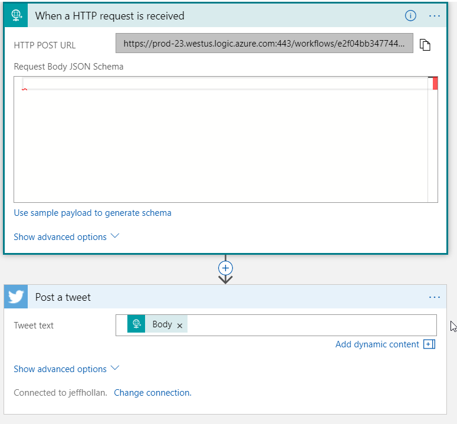

# Azure Serverless IoT Button

## Tweet with Azure Functions and Flic Button

This tutorial shows you how to integrate an Azure Function with your Flic button
by posting a tweet to your Twitter account when the Flic is clicked.  We are going to use Azure Functions for Serverless Compute, and Azure Logic Apps for serverless workflows/integration with Twitter.

Prerequisites:

-   Twitter account
-   Flic button
-   iPhone or Android smartphone with Flic app installed
-   Azure account

The solution will be:

> A Flic button sends an HTTPS request to an Azure Function which processes the data and sends a message to tweet to an Azure Logic App.  The Logic App fires and posts the tweet.

It only takes a few minutes to setup and get working end-to-end.

## Working with Functions in the Azure Portal

Functions can be created, developed, configured, and tested the Azure portal.


## Create a Function App

Functions require a function app to host function execution. This can be done in
the Azure portal.

1.  Log in to the Azure portal and click the New button in the upper left-hand
    corner.

2.  Click Compute > Function App. Then, configure your app settings:

    -   App Name: Create a globally unique name.

    -   Subscription: Add a new or existing subscription.

    -   Resource Group: Add a new or existing resource group.

    -   Hosting plan: the Consumption Plan is recommended.

    -   Location: Choose a location near you.

    -   Storage account: Create a globally unique name for the storage account
        that will be used by your function app, or use an existing account.

3.  Click Create.

## Create an HTTP Triggered Function

Now that the function app has been created, a function can be added to it. The
template for an HTTP triggered function will execute when sent an HTTP request.

1.  At the top of the portal, locate and click the magnifying glass button to
    search for your new function app. Enter the function app's name in the
    search bar to find and select it.

2.  Expand your new function app, then click the + button next to functions.

3.  Select the HttpTrigger function template for either C# or JavaScript.

4.  Change the Authorization level to Anonymous

5.  Click Create.

## Configure Function

1.	In the portal, expand the function and click Integrate in the expanded view.
2.	Add the following route to the Route template field: notify/{messageType:alpha}

This will give the function URL a path parameter `messageType` we can access within the function.

Next choose either [C#](#C#-sample) or [JavaScript](#javascript-sample) for a sample function.

## C# Sample

If writing a C# Function, here is the code you can use to send a request to a Logic App to post a Tweet:

```csharp
using System.Net;
using System.Net.Http;

public static async Task<HttpResponseMessage> Run(HttpRequestMessage req, string messageType, TraceWriter log)
{
    log.Info("C# HTTP trigger function processed a request.");
    var _messageMap = new Dictionary<string, string>
    {
        ["arrived"] = "Arrived at #ServerlessConf NYC. Trying out this cool #AzureFunctions demo",
        ["joinme"] = "You should join me at the Microsoft booth at #Serverlessconf NYC",
        ["azureserverless"] = "Azure Serverless is awesome! @AzureFunctions @logicappsio"
    };
     _messageMap.TryGetValue(messageType, out string message);
    var client = new HttpClient();
    await client.PostAsJsonAsync(Environment.GetEnvironmentVariable("LogicAppEndpoint", 
              EnvironmentVariableTarget.Process), message);
    return req.CreateResponse(HttpStatusCode.OK);
}
```

## JavaScript Sample

If writing a JavaScript function, here is the code you can use to send a request to a Logic App to post a tweet:

```javascript
const https = require('https');
const url = require('url');
const myURL = url.parse(process.env["LogicAppEndpoint"]);

module.exports = function (context, req) {
    context.log('JavaScript HTTP trigger function processed a request.');

    let messageType = context.bindingData.messageType;
    let messageMap = {
        arrived: "Arrived at #ServerlessConf NYC. Trying out this cool #AzureFunctions demo",
        joinme: "You should join me at the Microsoft booth at #Serverlessconf NYC",
        azurefunctions: "Azure Serverless is awesome! @AzureFunctions @logicappsio"
    };

    let statusMessage = messageMap[messageType];
    if(statusMessage) {
        const options = {
            hostname: myURL.hostname,
            port: 443,
            path: myURL.path,
            method: 'POST'
        };
        const req = https.request(options, (res) => { context.log(`STATUS: ${res.statusCode}`)});
        req.write(statusMessage);
        req.end();
        context.res = {
            status: 200,
            body: "Tweet sent"
        };
    } else {
        context.res = {
            status: 400,
            body: "Invalid request. Messing message type"
        };
    }

    context.done();
};
```

## Creating a tweeting Logic App

1. Click the **+ New** button in the Azure Portal
1. Click Web + Mobile > Logic App, and configure one in your subscription
1. After it is deployed, use the search in the top of the portal to open the logic app
1. Select to **Edit** (should open by default) and choose **Start from Blank**
1. Our function will invoke this workflow via HTTP, so add a "Request" trigger for **When an HTTP Request is received**.
1. After the trigger, click **New Step** and add an action with **Twitter** to **Post a Tweet**.  Login with your twitter account.
1. For the Tweet Text, select the request body from the trigger.
1. Click save, and copy the URL from the request trigger.



## Configure the Function Environment Variables

If you see in the code we reference the `LogicAppEndpoint`, now we just need to set that environmental variable.

1.	In the portal, navigate to the function app that hosts the recently created function.
2.	In the function app overview tab, click on Application settings.
3.	Scroll down to the Application settings section, click on the "+ Add new setting" button and add the key:
    - LogicAppEndpoint: *The Request URL from the Logic App* - something like `https://prod-23.westus.logic.azure.com:443/workflows/***`
1. Click **Save**

## Configure Flic

1.  Copy the function url by navigating to the function in the portal and
    clicking the "</> Get function URL" link. This url is needed in the Flic
    app and can be quite long. It is recommended to paste the url in a cloud
    based document for mobile access.

2.  In the Flic App, connect a button if you haven't already done so and enter
    the button settings by tapping it.

3.  For the click setting, press + to the right of the click command and add a
    Internet Request function to the button by searching in the function menu.

4.  Edit the function by adding the function url and adding one of the three
    routes that is mapped to a tweet message:

    -   **arrived**: "Arrived at #ServerlessConf NYC. Trying out
        #AzureFunctions"

    -   **joinme**: "You should join me at the Microsoft booth at
        #Serverlessconf NYC"

    -   **azureserverless**: "Azure Serverless is awesome!"

The url should look similar to this:

~~~~~~~~~~~~~~~~~~~~~~~~~~~~~~~~~~~~~~~~~~~~~~~~~~~~~~~~~~~~~~~~~~~~~~~~~~~~~~~~
https://myFunctionAppName.azurewebsites.net/api/notify/azurefunctions
~~~~~~~~~~~~~~~~~~~~~~~~~~~~~~~~~~~~~~~~~~~~~~~~~~~~~~~~~~~~~~~~~~~~~~~~~~~~~~~~

1.  Press done to save the settings.

2.  Repeat steps 3-4 for the button's double click and hold settings. Avoid
    reusing the same routes for each button setting.

## Triggering the Function

Based on your click command configuration, the HTTP function will send a request
to Twitter to authenticate and post a tweet to the specified account with one of
the three predefined messages. Because tweeting the same message twice in a row
is prohibited on Twitter, each button click command will only tweet once. Change
the tweet message text in the logic app or delete the posted tweets to create more
tweets through button clicks.
